<p align="center">
  
</p>

<h1 align="center">✈️ NxTrip – Flight Booking iOS App</h1>

<p align="center">
  <strong>A SwiftUI application for booking flights and managing tickets.</strong>
</p>

<p align="center">
  <a href="#📱-overview">📱 Overview</a> • 
  <a href="#🔧-core-components">🔧 Core Features</a> • 
  <a href="#📈-current-development-status">📈 Development Status</a> •
  <a href="#app-screenshots">📸 Screenshots</a> •
  <a href="#📦-project-structure">📦 Project Structure</a> 
</p>

<p align="center">
  <a href="#"></a>
  <a href="#"></a>
  <a href="#"></a>
</p>


## 📱 Overview

**NxTrip** is a modern iOS flight booking application built with SwiftUI that allows users to search for flights, book tickets, and manage their travel plans. The app features a clean, intuitive interface with comprehensive flight search capabilities and secure payment processing.

### Key Features
- ✈️ Flight search and booking
- 🔐 User authentication and profiles
- 💳 Payment method management
- 📋 Booking history and ticket management

## 🏗️ Technical Architecture

### Platform & Framework
- **Platform**: iOS 18.4+
- **Language**: Swift 5.0
- **UI Framework**: SwiftUI
- **Architecture**: MVVM (Model-View-ViewModel)
- **Database**: Firebase Firestore
- **Authentication**: Firebase Auth
- **Storage**: Firebase Storage

### Dependencies
```
- Firebase iOS SDK v11.13.0
  - FirebaseAuth
  - FirebaseFirestore  
  - FirebaseStorage
```

## 🔧 Core Components

### Authentication System
**Files**: `AuthViewModel.swift`, `LoginView.swift`, `RegisterView.swift`, `OpenView.swift`

#### Features:
- User registration and login with email/password *fullname for login*
- Social login options (Google/Apple - *in development*)
- Authetication thru Firebase Auth

#### Authentication Flow:
1. **Welcome Screen**: Modern dark-themed landing page with NxTrip branding
2. **Sign In**: Clean form with email and password fields
3. **Registration**: Multi-field form with name, email, and password confirmation
4. **Profile Management**: Comprehensive user settings and preferences

#### Key Functions:
```swift
func signIn(withEmail email: String, password: String)
func createUser(withEmail email: String, password: String, fullname: String)
func signOut()
func deleteAccount()
```

*Note: Google and Apple sign-in integration is planned for future releases.*

### Flight Search & Booking
**Files**: `FlightViewModel.swift`, `FlightSearchView.swift`, `BookingViewModel.swift`

#### Amadeus API Integration:
- Real-time flight search
- Airport lookup by keyword
- Flight pricing

#### Search Capabilities:
- Origin/destination airport selection
- Departure/return date selection
- Passenger count (adults + children) (*Note: This is not implemented but in our model it is stored for future*)
- One-way and round-trip flights

### Payment System
**Files**: `CreditCardModel.swift`, `AddCardView.swift`, `CardDetailsView.swift`

#### Features:
- Save up to 3 credit cards per user
- Card type detection (Visa, Mastercard, Amex)
- Default payment method selection
- Secure card information storage (only last 4 digits) (*Note: That's why autocompletion for this is off*)
- Card nickname support

### Ticket Management
**Files**: `TicketViewModel.swift`, `TicketsView.swift`, `TicketDetailView.swift`

#### Capabilities:
- View all booked flights with card design
- Ticket status tracking (Upcoming, Check-in Available, Completed)
- Advanced filtering: All, Upcoming, Check-in, Completed
- Search functionality by destination or booking reference
- Detailed flight information with boarding pass style design

#### Ticket Features:
- **Smart Status System**: Automatic flight status detection
- **Beautiful Cards**: Modern card design with flight routes
- **Quick Actions**: Copy ticket details, calendar integration (*planned, not implemented*)
- **Boarding Pass View**: Airline-style boarding pass presentation

#### Planned Features:
- Add to calendar integration
- Online check-in functionality (*probably not dont know hard it is*)


## 📱 User Interface Structure

### Screen Flow Overview

#### Authentication Flow
```
Welcome Screen (Dark Theme)
    ↓
Sign In / Register
    ↓
Main App (TabView)
```

#### Flight Booking Flow
```
Flight Search → Airport Selection → Booking → Success
```

## 🎨 Design System

### Color Scheme (`ColorScheme.swift`)
```swift
// Brand Colors
static let brandPurple = Color("BrandPurple")
static let brandBlack = Color("BrandBlack")

// Adaptive Colors (Light/Dark Mode)
static let primaryBackground = Color("PrimaryBackground")
static let secondaryBackground = Color("SecondaryBackground")
static let cardBackground = Color("CardBackground")
```

### Theme Support
- **Light Mode**: Clean white backgrounds with subtle grays
- **Dark Mode**: Rich dark backgrounds with enhanced contrast
- **Automatic Switching**: Respects system theme preferences
- **Consistent Branding**: Purple accents maintain brand identity across themes

## 🔌 API Integration

### Amadeus Travel API
**Service**: `AmadeusService.swift`

#### Endpoints Used:
1. **OAuth Token**: `/v1/security/oauth2/token`
2. **Airport Search**: `/v1/reference-data/locations`
3. **Flight Search**: `/v2/shopping/flight-offers`

#### Key Methods:
```swift
func searchAirports(keyword: String) -> [SimpleAirport]
func searchFlights(request: FlightSearchRequest) -> [SimpleFlight]
```


## 💾 Data Models

### User Management
```swift
struct User {
    let id: String
    let fullname: String
    let email: String
    let phone: String?
    let savedCards: [SavedCreditCard]
}
```

### Flight Data
```swift
struct SimpleFlight {
    let id: String
    let price: FlightPrice
    let itineraries: [SimpleItinerary]
}
```

### Booking Information
```swift
struct BookedTicket {
    let id: String
    let userId: String
    let bookingReference: String
    let flight: SimpleFlight
    let passengerInfo: PassengerInfo
    let paymentInfo: PaymentInfo
    let bookingDate: Date
}
```

## 📋 Key Functionalities

### ✈️ Flight Search
1. **Airport Selection**: Smart search with popular destinations
2. **Date Selection**: Flexible departure/return dates
3. **Passenger Count**: Adults and children support
4. **Flight Filtering**: Price, duration, stops

### 🎫 Booking Process
1. **Flight Review**: Detailed flight information
2. **Passenger Details**: Contact and travel information
3. **Payment**: Secure credit card processing
4. **Confirmation**: Booking reference generation

### 👤 Profile Management
1. **Personal Info**: Name and phone number updates
2. **Payment Methods**: Add/remove/manage credit cards
3. **Account Settings**: Sign out and account deletion

### 📱 Ticket Management
1. **Ticket History**: All booked flights
2. **Status Tracking**: Flight status indicators
3. **Details View**: Comprehensive ticket information
4. **Quick Actions**: Copy details, add to calendar

## 🔄 State Management

### ViewModels (MVVM Pattern)
- **AuthViewModel**: User authentication and profile
- **FlightViewModel**: Flight search and display
- **BookingViewModel**: Booking process management
- **TicketViewModel**: Ticket history and details

### Data Flow
```
View ↔ ViewModel ↔ Service/API ↔ Firebase/Amadeus
```

---

## 📦 Project Structure

```
iza-app/
├── Core/
│   ├── AmadeusService.swift
│   └── ColorScheme.swift
├── Models/
│   ├── User.swift
│   ├── FlightModel.swift
│   ├── TicketModel.swift
│   └── CreditCardModel.swift
├── ViewModels/
│   ├── AuthViewModel.swift
│   ├── FlightViewModel.swift
│   ├── BookingViewModel.swift
│   └── TicketViewModel.swift
├── Views/
│   ├── Authentication/
│   ├── CoreViews/
│   └── Booking/
└── Assets/
```

## 📈 Current Development Status

### ✅ Completed Features
- **Authentication System**: Full email/password authentication
- **Flight Search**: Real-time flight search with Amadeus API
- **Booking System**: Complete booking flow with payment processing
- **Ticket Management**: Comprehensive ticket history and details
- **Profile Management**: User settings and payment method management
- **Responsive Design**: Light/dark mode support
- **Data Persistence**: Firebase integration for user data

### 🚧 In Development
- **Social Authentication**: Google and Apple sign-in integration
- **Calendar Integration**: Add flights to device calendar
- **Online Check-in**: Direct airline check-in functionality
- **Push Notifications**: Flight status updates and reminders

### 🎯 Planned Features
- **Flight Status Tracking**: Real-time flight status updates
- **Offline Mode**: Basic functionality without internet
- **Multi-language Support**: Localization for international users

### App Screenshots

| Authentication Flow | Main Features | Ticket Management |
|---------------------|---------------|------------------|
| 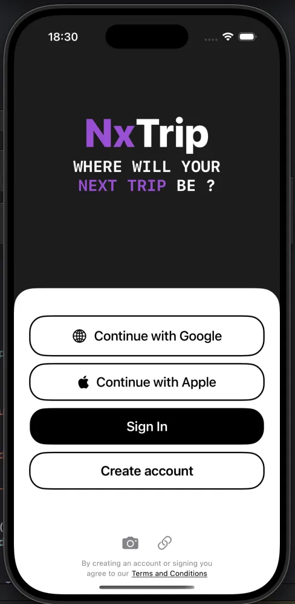 | 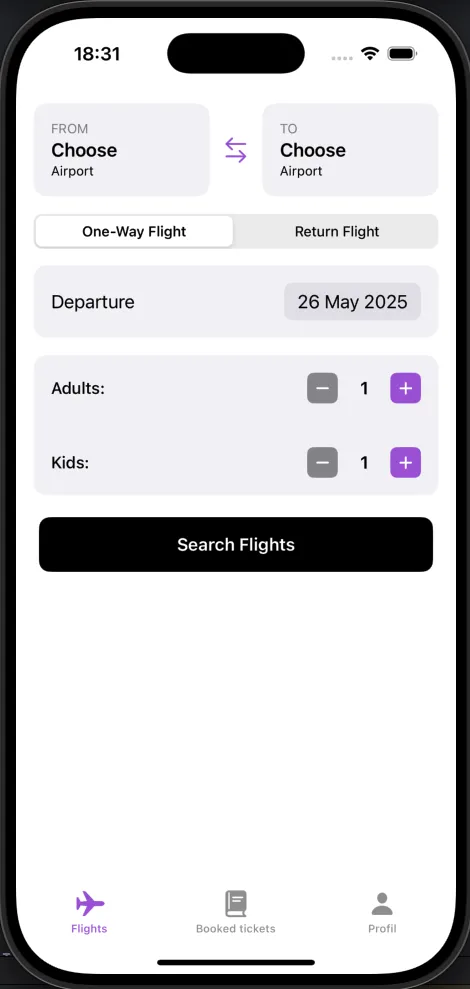 | 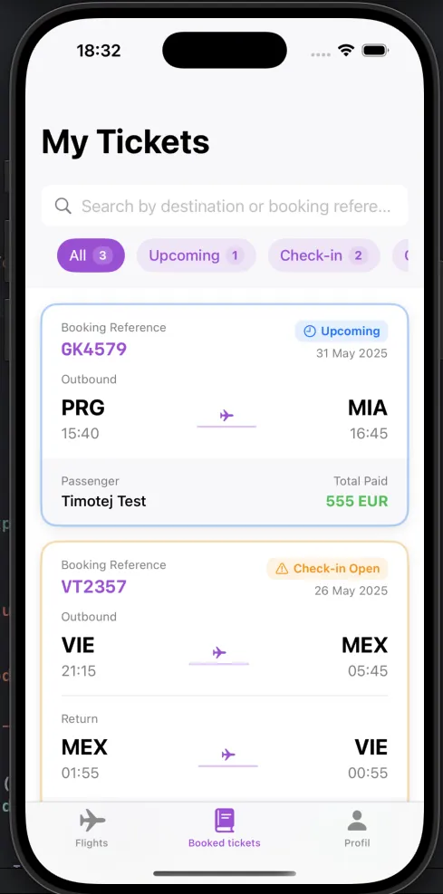 |
| 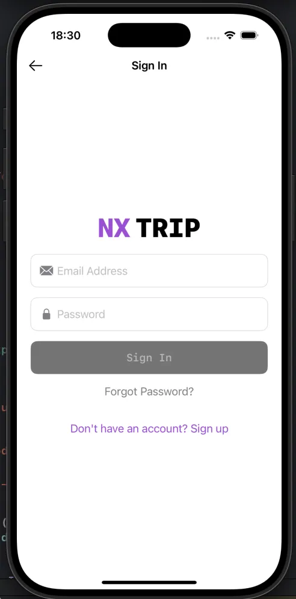 | 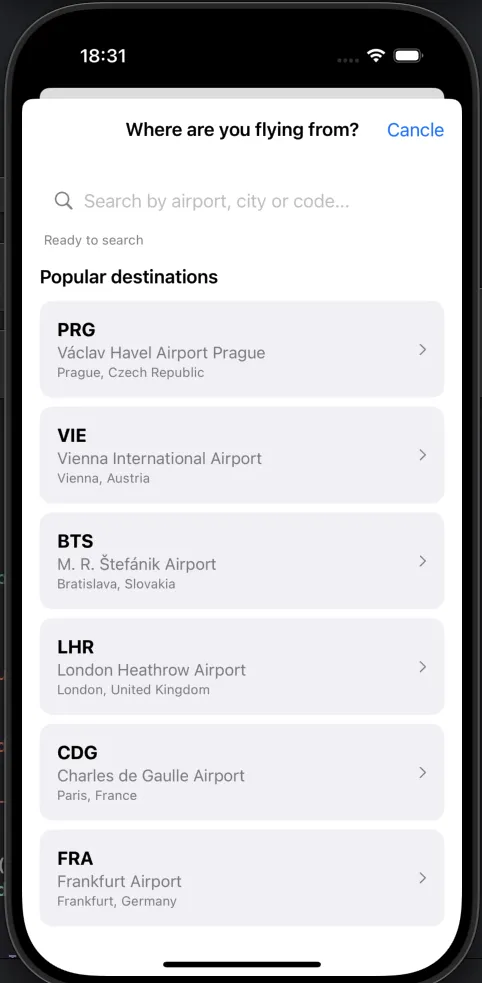 | 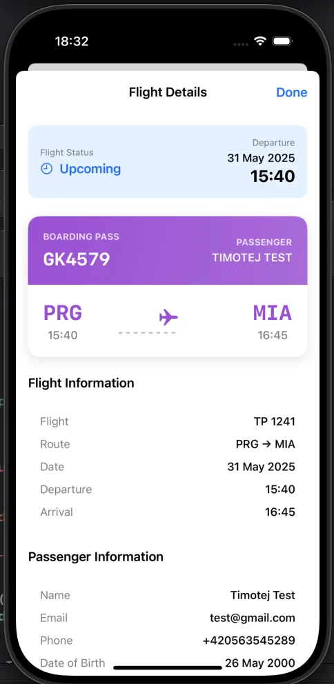 |
| 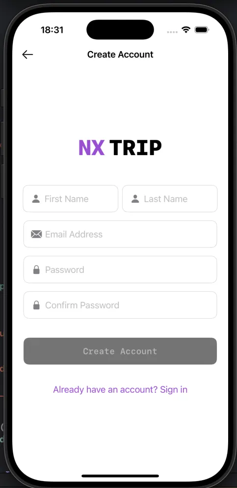 | 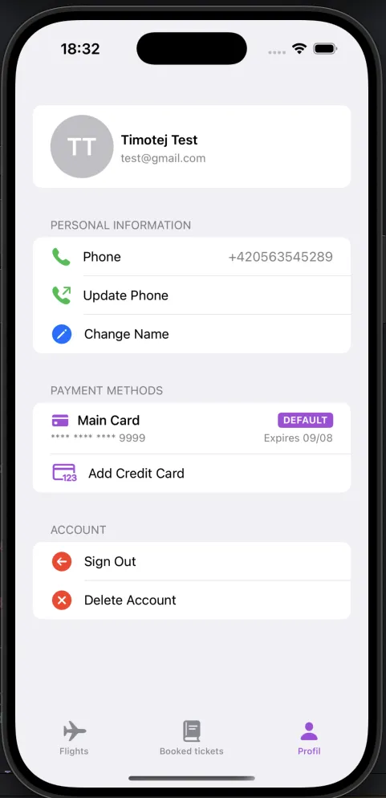 | 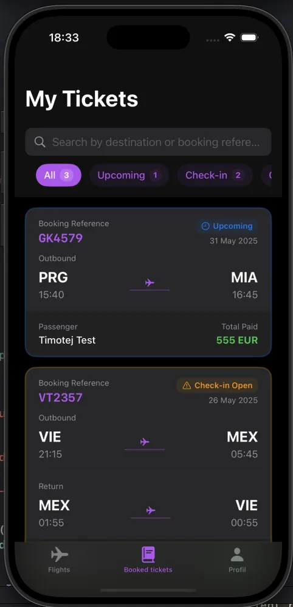 |

#### Booking Flow
| Booking Steps |  |
|---------------------|---------------|
| 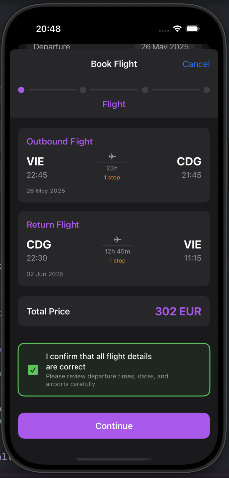 | 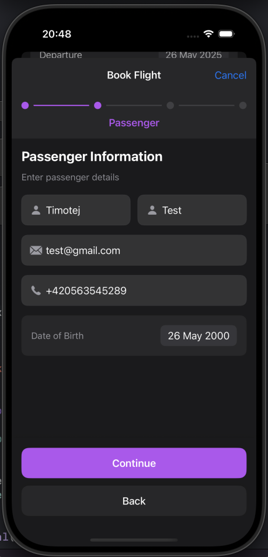 |
| 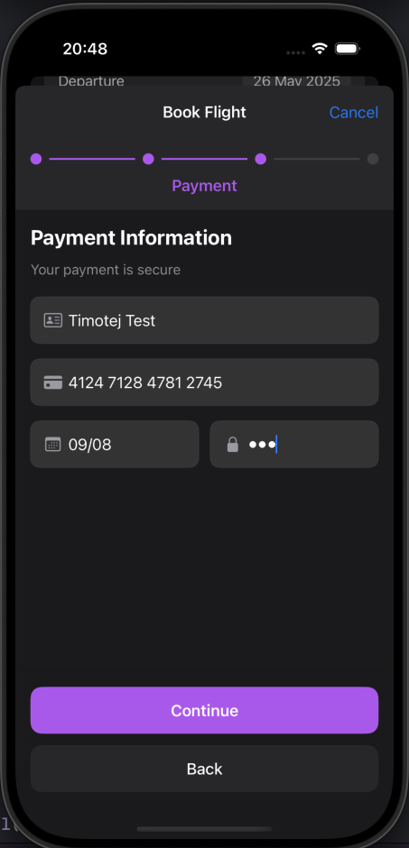 | 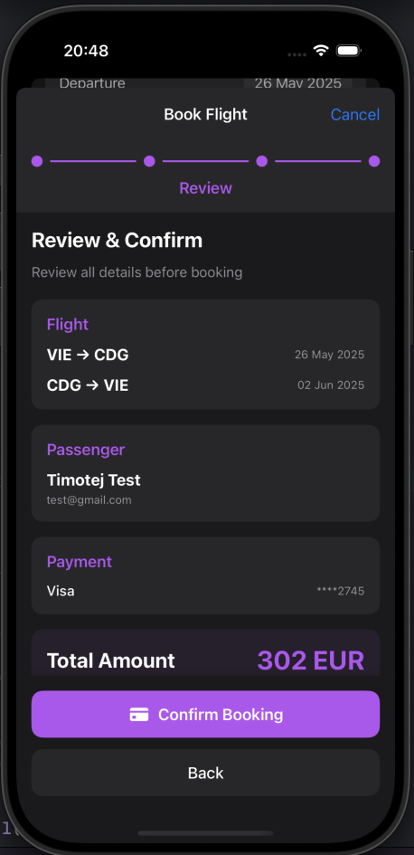 |
| 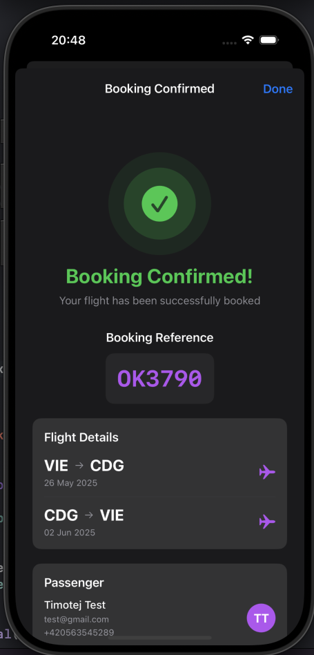 |  |

*Note: The app supports both light and dark mode themes for optimal user experience.*
